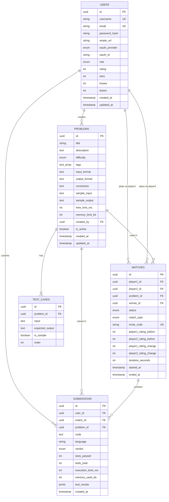

# DevDuel — Database Schema

## Entity Relationship Diagram

## Notes
- Default user rating: **1200** (standard Elo starting point)
- Match duration default: **1800 seconds** (30 minutes)
- Verdicts: AC (Accepted), WA (Wrong Answer), TLE (Time Limit Exceeded), RE (Runtime Error), CE (Compilation Error), MLE (Memory Limit Exceeded)
- Problems use Markdown for descriptions
- Tags stored as Postgres `TEXT[]` array for efficient filtering
